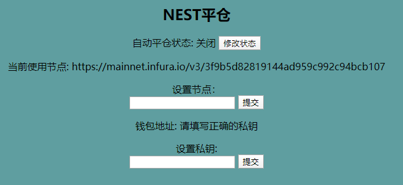
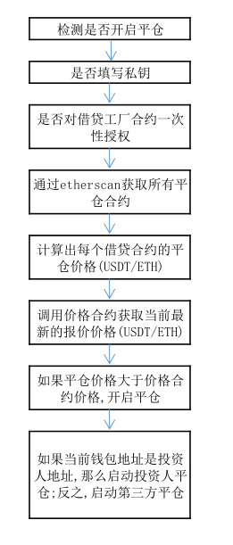

#### 自动平仓操作步骤

1. 在github下载源码

   方式1： 
   	打开CMD使用命令：git clone  https://github.com/NestFans/LoanClearBot.git

   方式2：

   	进入：https://github.com/NestFans/LoanClearBot，点击Download ZIP下载后解压到D盘

2. 找到start.bat文件，双击即可。（会弹出一个窗口，会打印相关数据，不要关闭）

3. 打开浏览器访问: http://127.0.0.1:8088/loan/miningData

   

4. 打开页面后:

   * 第一步： 设置私钥（填写私钥，点击"提交"）
   * 第二步：启动（点击"修改状态"）

#### 平仓流程图

	

#### 注意事项

1. 程序里面设置了一个默认节点, 如果使用的人数过多,达到节点访问上限,将无法使用.大家可以自己去 <https://infura.io/> 注册一个节点
